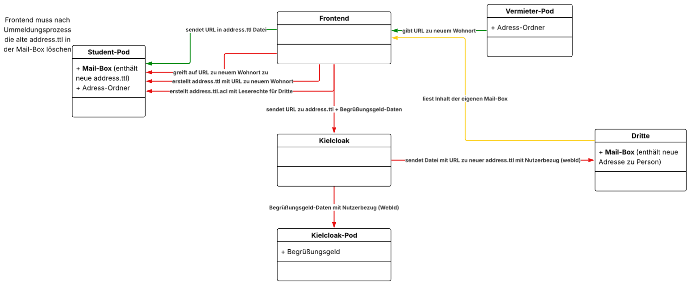

# KielCloak Backend

## Beschreibung

In diesem Repository wird das Backend (aka. KielCloak) der Anwendung implementiert. Die Aufgabe dieses Microservice ist die Abfrage und Bearbeitung von Daten. Die Rolle dieses Services kann mit folgendem Komponentendiagramm beschrieben werden:

## Benutzte Technologien

Für die Imlementierung verwenden wir ( Muss noch festgestellt werden! )

- Express Web Framework
- Typescript als Programmiersprache
- NodeJS als Laufzeitumgebung
